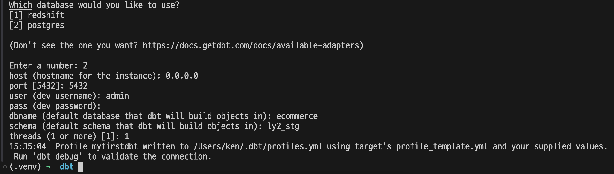
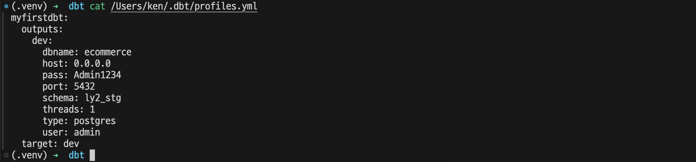

- [Python 환경 구성](#python-환경-구성)
- [DW 셋업](#dw-셋업)
- [DBT 셋업](#dbt-셋업)
    - [DBT \<-\> DW 연결 확인](#dbt---dw-연결-확인)
    - [VSCode Extensions](#vscode-extensions)
- [DBT 실습 시작](#dbt-실습-시작)


# Python 환경 구성
- dbt 외 필요한 lib 추가 설치
```bash
python3.10 -m venv .venv
source .venv/bin/activate
pip install --upgrade pip
pip install dbt-core
pip install dbt-redshift
pip install psycopg2
pip install faker
pip install python-dotenv
# for aws-mwaa-local-runner 
pip install 'apache-airflow[amazon]'
```

# DW 셋업
실습이므로 Redshift, Snowfake, Bigquery 대신 Local 에 PostgreSQL을 설치해서 사용한다.
- [PostgreSQL 셋업 링크](https://github.com/color275/dbt/tree/846887943c2365b775c73bc2a5c5ede1ade43666/postgresql)


# DBT 셋업
```bash
dbt init myfirstdbt
``````


dbt profile 확인
```bash
cat /Users/ken/.dbt/profiles.yml
```


### DBT <-> DW 연결 확인
```bash
cd myfirstdbt
dbt debug
```


### VSCode Extensions
1. Power User for dbt Core 설치
   

2. DBT 연결
   
   

3. Extension 기능
   


# DBT 실습 시작
[실습 링크](https://github.com/color275/dbt/tree/846887943c2365b775c73bc2a5c5ede1ade43666/myfirstdbt)


