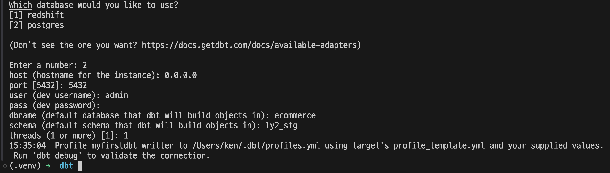
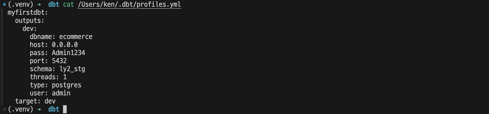
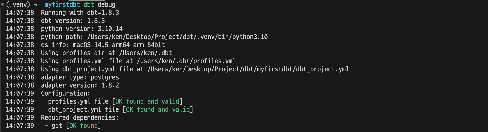
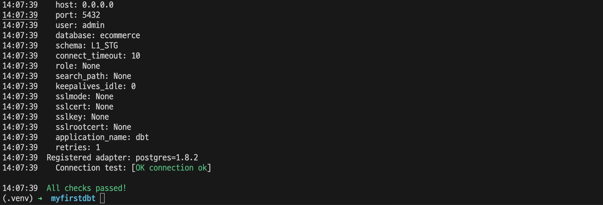
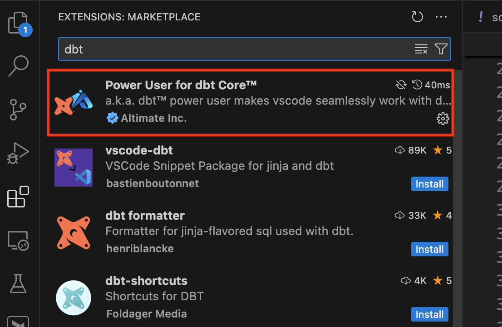
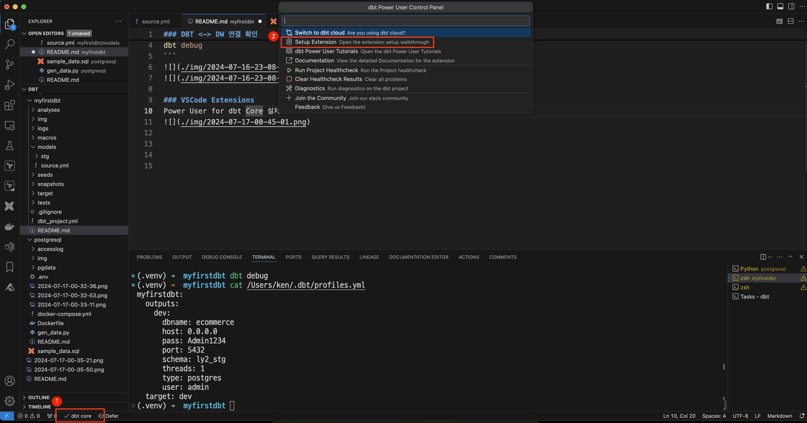
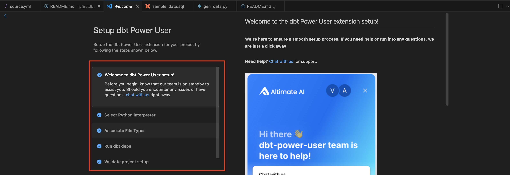
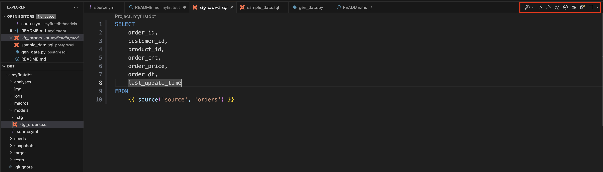

# python 환경 구성
- dbt 외 필요한 lib 추가 설치
```bash
python3.10 -m venv .venv
source .venv/bin/activate
pip install --upgrade pip
pip install dbt-core
pip install dbt-redshift
pip install psycopg2
pip install faker
pip install python-dotenv
```

dbt 설치
```bash
dbt init myfirstdbt
``````


dbt profile 확인
```bash
cat /Users/ken/.dbt/profiles.yml
```


### DBT <-> DW 연결 확인
```bash
cd myfirstdbt
dbt debug
```



### VSCode Extensions
1. Power User for dbt Core 설치
   

2. DBT 연결
   
   

3. Extension 기능
   