# What is DBT

DataWarehouse(DW) 내에서 데이터 변환을 도와주는 도구. ELT 중 T 에 집중.
- DataWarehouse
  - Redshift
  - Snowflake
  - BigQuery
  - Databricks

# Why DBT
1. 오픈소스
2. 특별한 기술이 필요하지 않다.
3. AWS, GCP 등의 클라우드 데이터 플랫폼과의 호환성
4. 다양한 Built in Features 
   - 버전관리, 형상관리
   - 테스트 자동화
   - 문서 자동화
   - Lineage 시각화
1. 손쉬운 협업 환경
   - 코드 기반 플랫폼 
   - 문서, 배포 자동화
  
# ELT vs ETL

### ETL Architecture
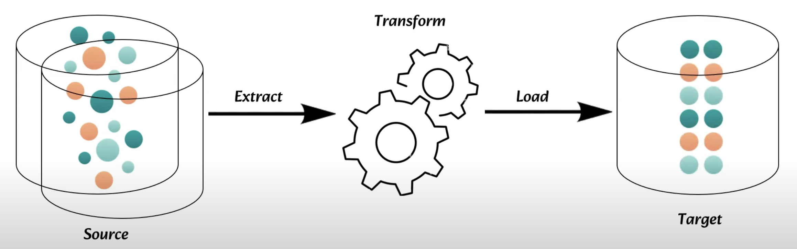

### ELT Architecture
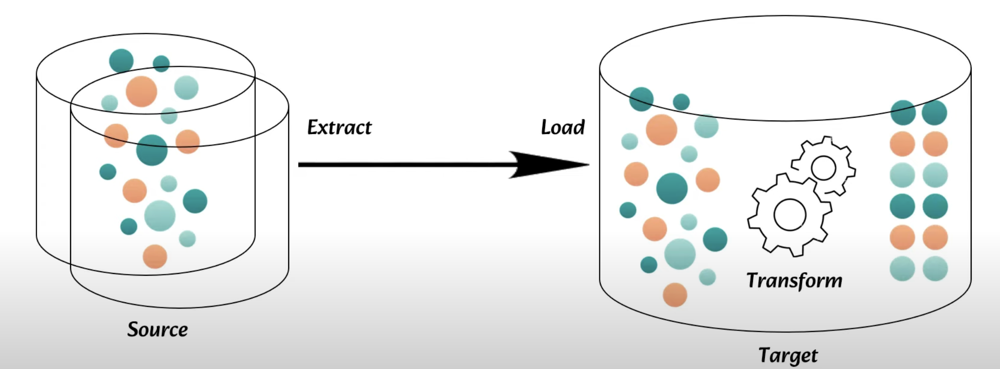

### Why Shift from ETL to ELT?
1. 비용 효율적
2. 확장성/유연성
3. 분석을 위한 데이터 Delivery  (Faster Time-to-Insight)
4. 데이터 거버넌스 향상 (리니지, 데이터 추적)

# First Model 작성

### CTE (Common Table Expression)란?
CTE는 일시적인 결과 세트를 정의하고 이 결과 세트를 나중에 SELECT, INSERT, UPDATE, DELETE 문의 일부로 사용할 수 있게 하는 SQL 구성 요소
1. 가독성 향상: 복잡한 쿼리를 여러 부분으로 나누어 각각의 부분을 이해하기 쉽게 만듭니다.
2. 재사용성: 동일한 서브쿼리를 여러 번 작성할 필요 없이, 한 번 정의한 후 여러 곳에서 사용할 수 있습니다.
3. 디버깅 용이: 각 CTE를 개별적으로 실행하여 중간 결과를 확인하고 디버깅할 수 있습니다.
4. 모듈화: 쿼리를 여러 단계로 나누어 논리적으로 모듈화할 수 있습니다.

### CTE 기본구조
```sql
WITH cte_name AS (
    -- CTE를 정의하는 쿼리
    SELECT ...
)
SELECT ...
FROM cte_name;
```

아래 CTE 쿼리를 `models/customer_orders_product.sql` 에 저장
<details>
<summary>First Model</summary>

```sql
WITH customer_data AS (
    SELECT 
        customer_id,
        first_name,
        last_name,
        email,
        phone_number,
        address
    FROM ly1_raw.customer
),
order_data AS (
    SELECT
        order_id,
        promo_id,
        order_cnt,
        order_price,
        order_dt,
        customer_id,
        product_id
    FROM ly1_raw.orders
),
product_data AS (
    SELECT
        product_id,
        name AS product_name,
        category,
        price
    FROM ly1_raw.product
)
SELECT 
    o.order_id,
    o.order_dt,
    o.order_cnt,
    o.order_price,
    c.first_name,
    c.last_name,
    c.email,
    c.phone_number,
    c.address,
    p.product_name,
    p.category,
    p.price
FROM order_data o
JOIN customer_data c ON o.customer_id = c.customer_id
JOIN product_data p ON o.product_id = p.product_id
```
</details>

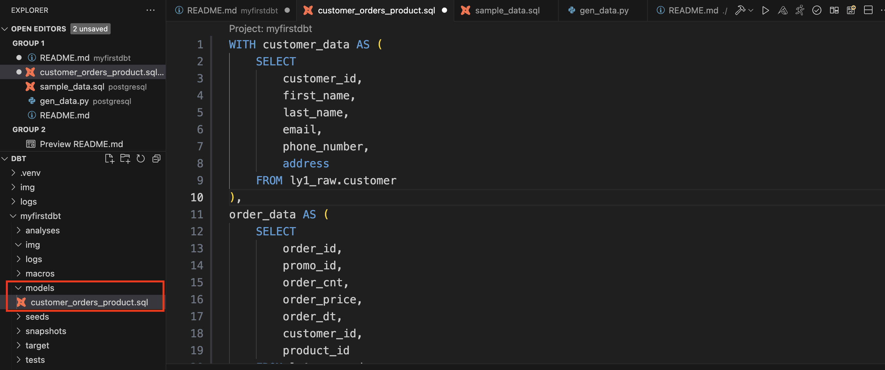

DBT 실행
```bash
dbt run
```
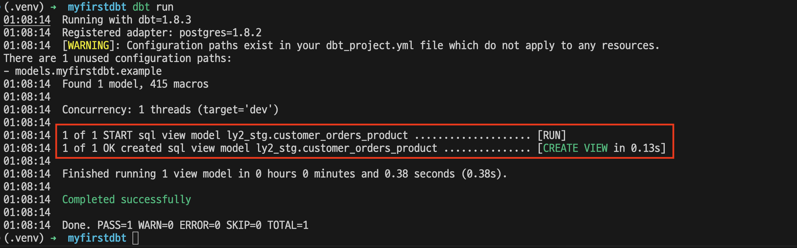

DW 확인 : `customer_orders_product` 이름의 View 생성
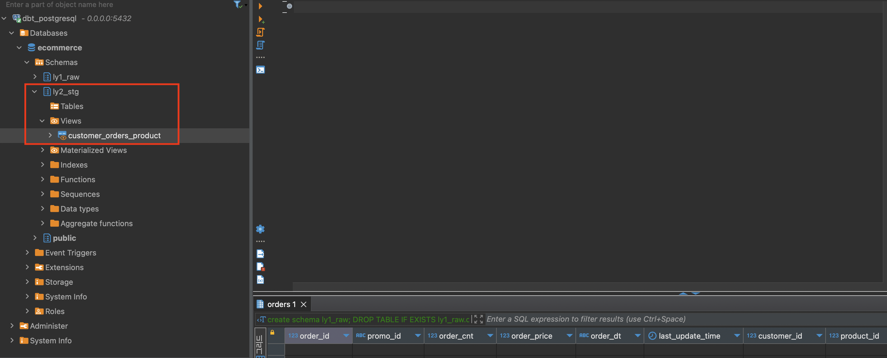

데이터 확인 : VSCode 의 DBT Extesions를 통해 확인 가능
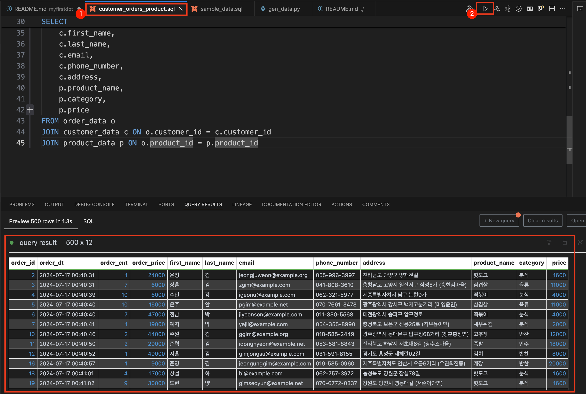

> [!TIP] VIEW 로 생성된 이유
> default 가 View 이기 때문
> 
> View 가 아닌 Table 등으로 변경하기 위해서는 dbt_project.yml 의 models 부분을 수정하거나 models 의 sql 파일 상단에 정의

dbt_project.yml 
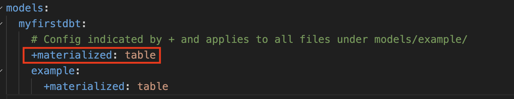

customer_orders_product.sql
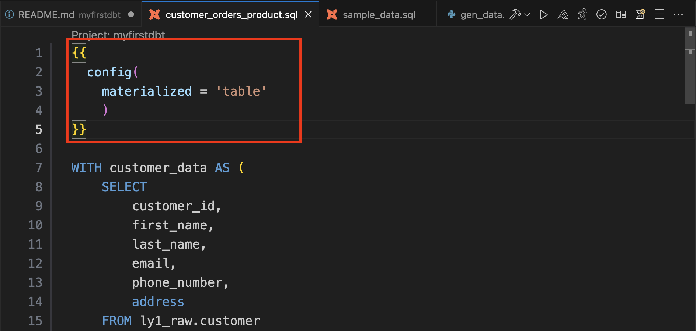

# Staging 모델 생성
> 각 raw 테이블들을 스테이징 레이어에서 사용할 수 있도록 stg_xxx 명명으로 추가
> `models/stg/` 디렉토리 추가
> 아래 sql 파일 추가

<details>
<summary>Staging</summary>

```sql
-- models/staging/stg_customer.sql
WITH customer AS (
    SELECT 
        customer_id,
        username,
        first_name,
        last_name,
        email,
        -- Full name 생성
        CONCAT(first_name, ' ', last_name) AS full_name,
        -- 가입 연도 추출
        EXTRACT(YEAR FROM date_joined) AS signup_year,
        -- 전화번호의 국가 코드 추출 (가정: 전화번호 형식이 '+82-10-1234-5678' 형태일 경우)
        CASE
            WHEN phone_number LIKE '+%' THEN SUBSTRING(phone_number FROM 1 FOR POSITION('-' IN phone_number) - 1)
            ELSE NULL
        END AS country_code
    FROM ly1_raw.customer
)

SELECT * FROM customer
```

```sql
-- models/staging/stg_orders.sql
WITH orders AS (
    SELECT
        order_id,
        promo_id,
        order_cnt,
        order_price,
        order_dt,
        customer_id,
        product_id,
        -- 총 주문 금액 계산
        order_cnt * order_price AS total_order_value
    FROM ly1_raw.orders
)

SELECT * FROM orders
```

```sql
WITH product AS (
    SELECT
        product_id,
        name,
        category,
        price,
        -- 카테고리를 대문자로 변환
        UPPER(category) AS upper_category,
        -- 가격 범주화 (예: 0-10000, 10001-20000, 20001 이상)
        CASE
            WHEN price <= 10000 THEN 'Low'
            WHEN price <= 20000 THEN 'Medium'
            ELSE 'High'
        END AS price_category
    FROM ly1_raw.product
)

SELECT * FROM product
```
</details>

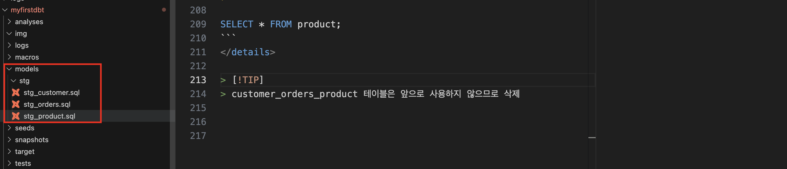
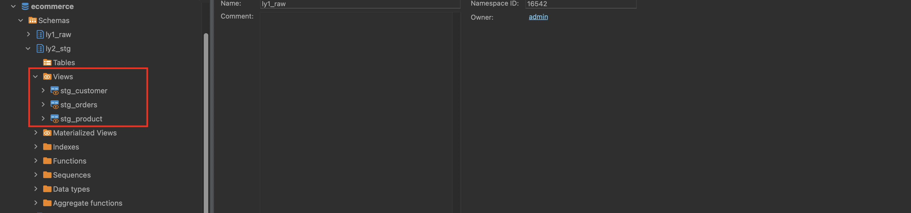

> [!TIP]
> customer_orders_product 테이블은 앞으로 사용하지 않으므로 삭제

# fact 모델 생성

`models/mart/` 디렉토리 생성 후 아래 SQL 을 f_orders.sql 이름으로 저장

<details>

<summary></summary>

```sql
-- models/mart/f_orders.sql
WITH customer AS (
    SELECT * FROM {{ ref('stg_customer') }}
),
orders AS (
    SELECT * FROM {{ ref('stg_orders') }}
),
product AS (
    SELECT * FROM {{ ref('stg_product') }}
)

-- 주문 정보 요약 테이블 생성
SELECT 
    TO_DATE(orders.order_dt, 'YYYY-MM-DD') AS order_date,
    product.product_id,
    product.name AS product_name,
    product.upper_category AS product_category,
    product.price_category,
    SUM(orders.order_cnt) AS total_order_count,
    SUM(orders.total_order_value) AS total_order_value
FROM orders
JOIN customer ON orders.customer_id = customer.customer_id
JOIN product ON orders.product_id = product.product_id
GROUP BY 
    TO_DATE(orders.order_dt, 'YYYY-MM-DD'),
    product.product_id,
    product.name,
    product.upper_category,
    product.price_category
ORDER BY 
    order_date,
    product_id
```

</details>

모델 생성
```bash
dbt run
```

생성된 스키마 구조를 확인 했을 때 아래 캡처처럼 f_orders 테이블이 ly2_stg 스키마 내 view 형태로 생성되었음을 알 수 있다.
- ly2_stg 에 생성된 이유는 최초 dbt init 때 지정한 schema 가 ly2_stg 이므로 default 로 사용이 되었다. (~/.dbt/profiles.yml)
- view 로 생성된 이유는 dbt_project.yml 내 models 섹션에 materialized 를 정의하지 않으면 default view 로 생성된다.
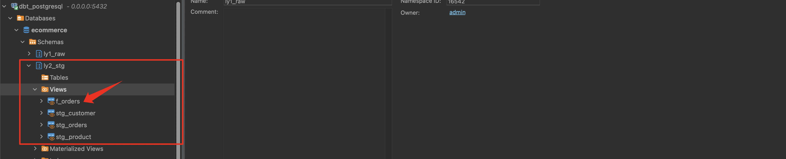

f_orders 테이블이 ly3_mart 스키마 내에 table 형태로 생성될 수 있도록 수정하자.
dbt_project.yml 파일에 models 부분을 아래와 같이 수정한 후 dbt run 을 실행한다.
```yaml
models:
  myfirstdbt:
    stg:
      +materialized: view
    mart:
      +materialized: table
      +schema: ly3_mart
```

```bash
dbt run
```

f_orders 이 테이블 형태로 생성이 되었지만 스키마가 ly2_stg_ly3_mart 로 만들어졌다. 왜?
[참고링크](https://docs.getdbt.com/docs/build/custom-schemas#how-does-dbt-generate-a-models-schema-name) 에 따르면 `generate_schema_name` 매크로 적용을 받기 때문에 `{{ default_schema }}_{{ custom_schema_name | trim }}`로 스키마가 생성되게 된다. 따라서 이 매크로를 오버라이딩 하면 된다.
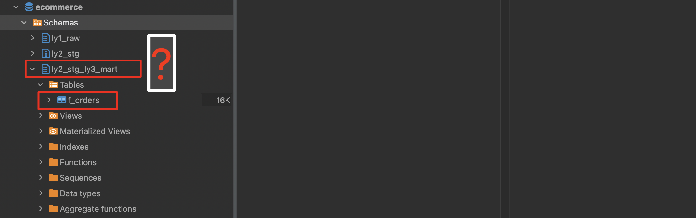

macros/generate_schema_name.sql 를 생성한 후 아래 매크로를 저장한다. ({{ default_schema }}_ 를 삭제함)

<details>

<summary>generate_schema_name 매크로 수정</summary>

```sql


    
    

        {{ default_schema }}

    

        {{ custom_schema_name | trim }}

    


```

</details>

dbt run 실행하면 아래와 같이 ly3_mart 스키마가 정상적으로 생성된 것을 확인할 수 있다.
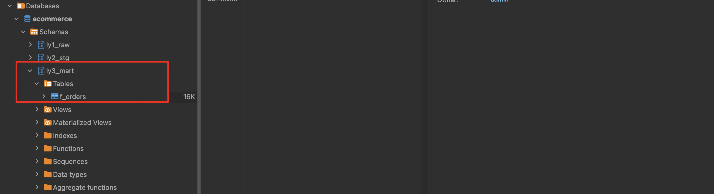

이제 f_orders 의 데이터도 확인해 보자.
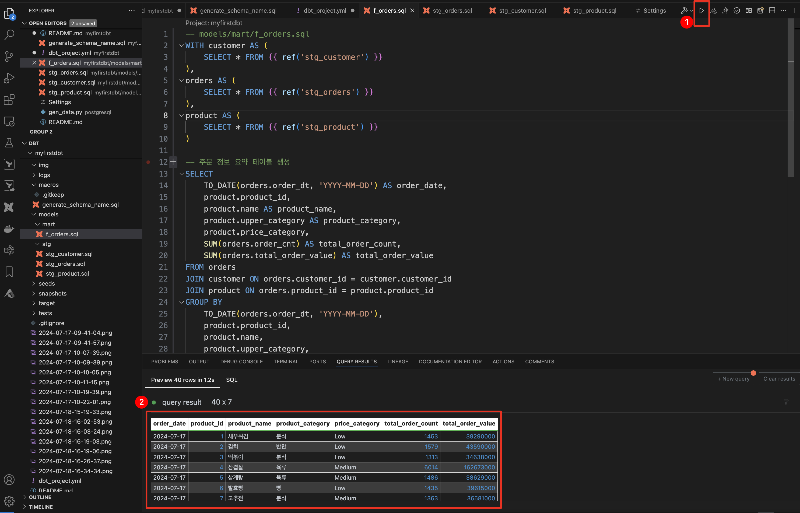
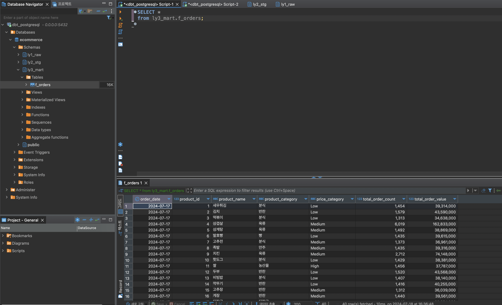

리니지도 확인해 보자
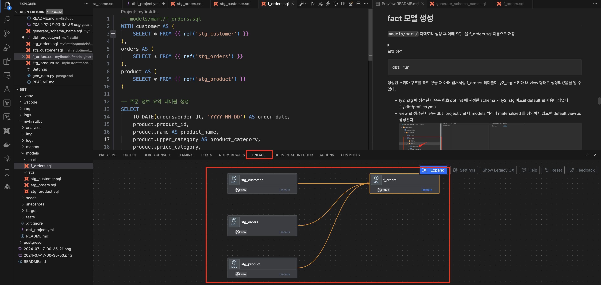

|          | 뷰(View)                                  | 테이블(Table)                                                                         |
| -------- | ----------------------------------------- | ------------------------------------------------------------------------------------- |
| **목적** | 간단한 변환에 적합                        | 더 집중적인 변환에 적합                                                               |
| **실행** | 모델에 정의된 변환이 참조될 때마다 실행됨 | 모델에 정의된 변환이 사전에 실행되고, 결과 데이터는 데이터 플랫폼에 지속적으로 저장됨 |
| **저장** | 추가 저장 공간을 차지하지 않음            | 물리적 테이블에 대해 저장 공간이 필요함                                               |
| **성능** | 이후 단계에서 성능이 느려질 수 있음       | 이후 프로세스의 성능이 향상됨                                                         |

# Seed 활용
CSV 파일과 같은 데이터를 데이터베이스에 로드하는 기능. 이 기능을 사용하면 초기 데이터나 기준 데이터를 쉽게 로드하고 관리할 수 있다.

- `seeds/product_type_weights.csv` 파일 내용 확인 
- dbt_project.yml 파일에 아래 내용 추가
    ```yaml
    seeds:
        +schema: ly1_raw
    ```
- dbt seed 실행
    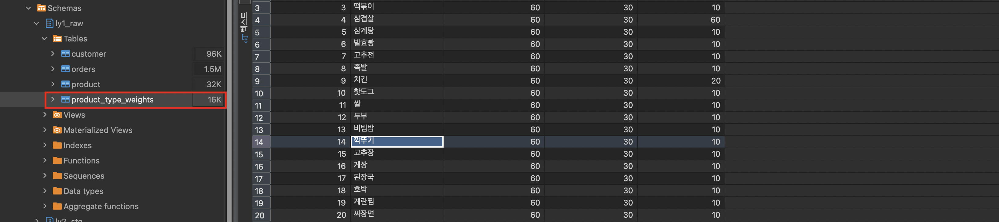

seed 를 활용하여 테이블을 생성했으니 stg_product_type_weights 를 생성하고, f_orders_weights.sql 도 만들어 보자.

<details>

<summary>stg_product_type_weights, stg_product_type_weights 생성</summary>

```sql
-- models/staging/stg_product_type_weights.sql
WITH product_type_weights AS (
    SELECT 
        product_id,
        product_name,
        products_weight,
        basket_weight,
        order_weight
    FROM ly1_raw.product_type_weights
)

SELECT * FROM product_type_weights
```

```sql
-- models/final/f_product_weights.sql

WITH product AS (
    SELECT * FROM {{ ref('stg_product') }}
),
product_type_weights AS (
    SELECT * FROM {{ ref('stg_product_type_weights') }}
)

-- 제품 정보와 가중치 정보를 결합한 요약 테이블 생성
SELECT 
    p.product_id,
    p.name AS product_name,
    p.upper_category AS product_category,
    p.price,
    p.price_category,
    ptw.products_weight,
    ptw.basket_weight,
    ptw.order_weight
FROM product p
JOIN product_type_weights ptw ON p.product_id = ptw.product_id
ORDER BY 
    p.product_id
```

</details>

# Sources 활용
sources는 데이터베이스에서 원시 데이터를 가져오는 테이블이나 뷰를 정의. 이는 DBT 모델에서 참조할 수 있는 데이터의 출처를 명확히 하고, 데이터 계보를 추적하는 데 도움이 된다.

<details>

<summary>models/source.yml 파일 생성</summary>

```yaml
sources:
  - name: ly1_raw
    tables:
      - name: customer
      - name: orders
      - name: product
      - name: product_type_weights
```

</details>

각 stg_****.sql 파일을 열어 `{{ source('ly1_raw','customer')}}` 와 같이 수정
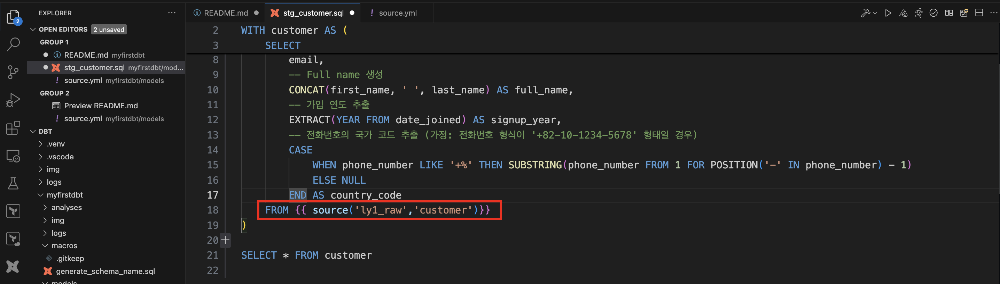

dbt run 을 통해 정상 작동 확인

리니지 확인
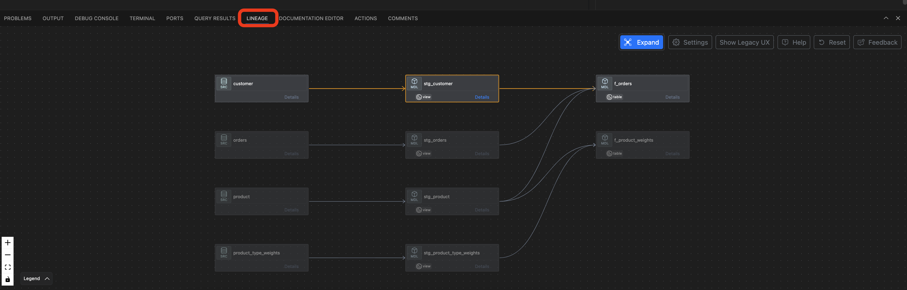

# Analyses 활용
analyses는 데이터를 탐색하거나 임시 보고서를 생성하는 데 사용. 모델 파일의 컴파일된 출력을 시각적으로 검사하는 데 유용. analyses 디렉토리에 저장된 SQL 파일은 데이터베이스에서 직접 실행되어 결과를 확인.

아래 쿼리를 analyses/monthly_customer_signup_trend.sql 에 저장
<details>

<summary>최근 1년 동안의 월별 고객 가입 수를 분석하여 트렌드를 파악</summary>

```sql
-- analyses/monthly_customer_signup_trend.sql

WITH customer AS (
    SELECT 
        customer_id,
        date_joined
    FROM {{ source('ly1_raw', 'customer') }}
)

SELECT
    DATE_TRUNC('month', date_joined) AS month,
    COUNT(customer_id) AS customer_count
FROM customer
WHERE date_joined >= DATE_TRUNC('year', CURRENT_DATE) - INTERVAL '1 year'
GROUP BY month
ORDER BY month
```

</details>

dbt compile 후 `target/compiled/myfirstdbt/analyses/` 에서 확인. 또는 vscode 의 extension 을 통해 확인
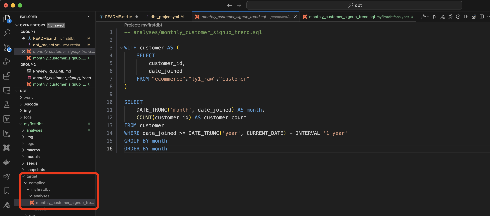


# TEST
DBT의 테스트는 크게 Singular 테스트와 Generic 테스트로 나뉜다.

| 특징      | Singular 테스트                               | Generic 테스트                                                     |
| --------- | --------------------------------------------- | ------------------------------------------------------------------ |
| 목적      | 특정 비즈니스 로직 또는 요구사항 검증         | 공통적인 데이터 무결성 검증 (예: not_null, unique 등)              |
| 정의 방법 | `tests` 디렉토리에 개별 SQL 파일로 정의       | `schema.yml` 등 파일에 매개변수화된 형태로 정의                       |
| 재사용성  | 재사용하기 어려움                             | 여러 모델과 컬럼에 쉽게 적용 가능                                  |
| 사용 예시 | 특정 조건을 만족하는 레코드가 존재하는지 확인 | 컬럼 값이 null이 아닌지, 유일한지, 특정 값 집합에 속하는지 등 확인 |

### Singular 테스트
- Singular 테스트는 특정한 비즈니스 로직이나 요구사항을 검증하기 위해 작성된 개별 SQL 쿼리. 
- 주로 특정한 상황이나 케이스를 테스트하는 데 사용. 
- Singular 테스트는 tests 디렉토리에 .sql 파일로 작성되며, 각 파일은 독립적으로 실행.

<details>

<summary>tests/not_null_order_price.sql</summary>

```sql
-- tests/not_null_order_price.sql
-- orders 테이블에서 order_price가 음수인 레코드가 있는지 확인. 만약 결과가 반환되면, 테스트는 실패한 것으로 간주
SELECT *
FROM {{ source('ly1_raw','orders') }}
WHERE order_price < 0
```

</details>

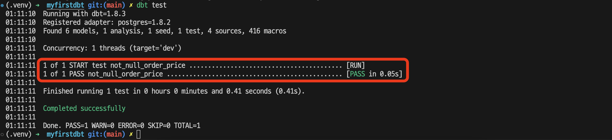

`dbt test` 를 통해 테스트 수행


### Generic 테스트
- DBT는 몇 가지 기본적인 Generic 테스트를 제공하며, 이는 데이터 무결성을 확인하는 데 유용. 
- 예를 들어, not_null, unique, accepted_values 등이 있음.

#### 내장된 Generic 테스트

<details>

<summary>models/stg/schema.yml</summary>

```yml
version: 2

models:
- name: stg_orders
  columns:
  - name: order_id
    tests:
    - not_null
    - unique
  - name: product_id
    tests:
    - not_null
    - relationships:
        to: ref('stg_product')
        field: product_id

```

</details>

`dbt test` 실행
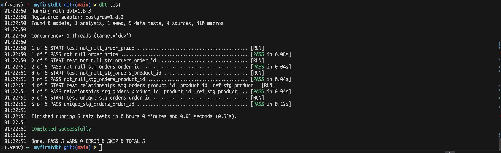

#### 커스텀 Generic 테스트

<details>

<summary></summary>

```sql

    SELECT *
    FROM {{ model }}
    WHERE {{ column_name }} < 0

```

</details>

`models/stg/schema.yml`에 아래 내용 추가
```yml
  - name: order_price
    tests:
    - not_negative
```
`dbt test` 실행
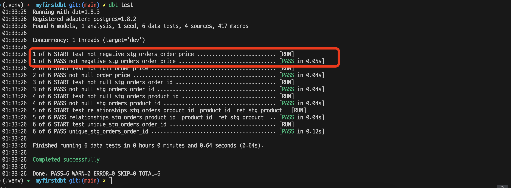