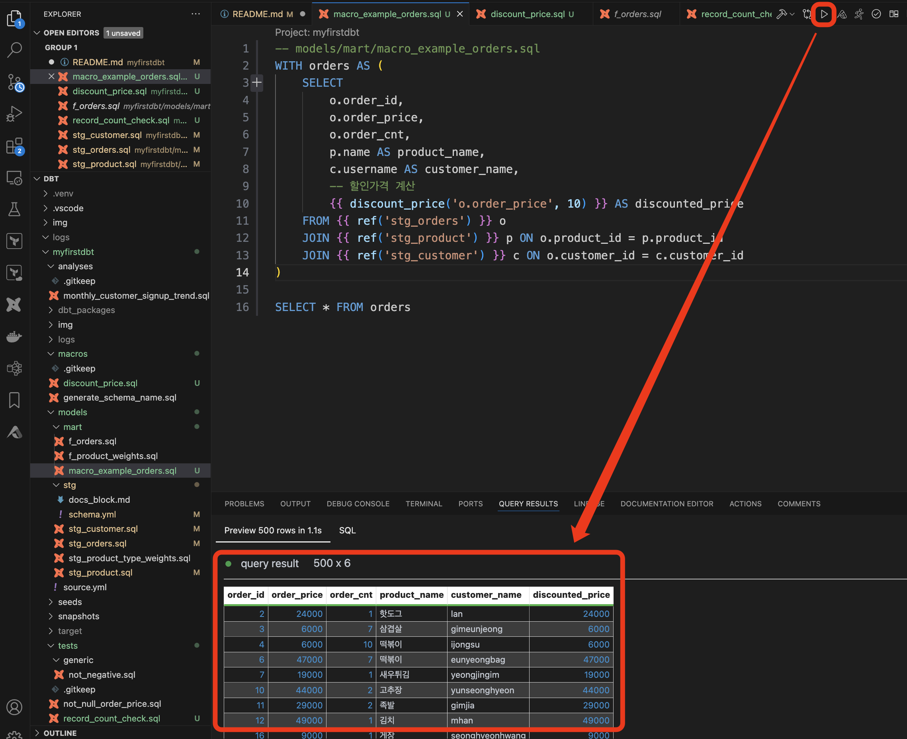

# What is DBT

DataWarehouse(DW) 내에서 데이터 변환을 도와주는 도구. ELT 중 T 에 집중.
- DataWarehouse
  - Redshift
  - Snowflake
  - BigQuery
  - Databricks

# Why DBT
1. 오픈소스
2. 특별한 기술이 필요하지 않다.
3. AWS, GCP 등의 클라우드 데이터 플랫폼과의 호환성
4. 다양한 Built in Features 
   - 버전관리, 형상관리
   - 테스트 자동화
   - 문서 자동화
   - Lineage 시각화
1. 손쉬운 협업 환경
   - 코드 기반 플랫폼 
   - 문서, 배포 자동화
  
# DBT 관련 Link
- [분석 엔지니어링 용어집](https://docs.getdbt.com/glossary)
- [DBT Best Practics](https://docs.getdbt.com/best-practices)

# ELT vs ETL

### ETL Architecture


### ELT Architecture


### Why Shift from ETL to ELT?
1. 비용 효율적
2. 확장성/유연성
3. 분석을 위한 데이터 Delivery  (Faster Time-to-Insight)
4. 데이터 거버넌스 향상 (리니지, 데이터 추적)

# First Model 작성

### CTE (Common Table Expression)란?
CTE는 일시적인 결과 세트를 정의하고 이 결과 세트를 나중에 SELECT, INSERT, UPDATE, DELETE 문의 일부로 사용할 수 있게 하는 SQL 구성 요소
1. 가독성 향상: 복잡한 쿼리를 여러 부분으로 나누어 각각의 부분을 이해하기 쉽게 만듭니다.
2. 재사용성: 동일한 서브쿼리를 여러 번 작성할 필요 없이, 한 번 정의한 후 여러 곳에서 사용할 수 있습니다.
3. 디버깅 용이: 각 CTE를 개별적으로 실행하여 중간 결과를 확인하고 디버깅할 수 있습니다.
4. 모듈화: 쿼리를 여러 단계로 나누어 논리적으로 모듈화할 수 있습니다.

### CTE 기본구조
```sql
WITH cte_name AS (
    -- CTE를 정의하는 쿼리
    SELECT ...
)
SELECT ...
FROM cte_name;
```

아래 CTE 쿼리를 `models/customer_orders_product.sql` 에 저장
<details>
<summary>First Model</summary>

```sql
WITH customer_data AS (
    SELECT 
        customer_id,
        first_name,
        last_name,
        email,
        phone_number,
        address
    FROM ly1_raw.customer
),
order_data AS (
    SELECT
        order_id,
        promo_id,
        order_cnt,
        order_price,
        order_dt,
        customer_id,
        product_id
    FROM ly1_raw.orders
),
product_data AS (
    SELECT
        product_id,
        name AS product_name,
        category,
        price
    FROM ly1_raw.product
)
SELECT 
    o.order_id,
    o.order_dt,
    o.order_cnt,
    o.order_price,
    c.first_name,
    c.last_name,
    c.email,
    c.phone_number,
    c.address,
    p.product_name,
    p.category,
    p.price
FROM order_data o
JOIN customer_data c ON o.customer_id = c.customer_id
JOIN product_data p ON o.product_id = p.product_id
```
</details>


DBT 실행
```bash
dbt run
```


DW 확인 : `customer_orders_product` 이름의 View 생성


데이터 확인 : VSCode 의 DBT Extesions를 통해 확인 가능


> [!TIP] VIEW 로 생성된 이유
> default 가 View 이기 때문
> 
> View 가 아닌 Table 등으로 변경하기 위해서는 dbt_project.yml 의 models 부분을 수정하거나 models 의 sql 파일 상단에 정의

dbt_project.yml 


customer_orders_product.sql


# Staging 모델 생성
> 각 raw 테이블들을 스테이징 레이어에서 사용할 수 있도록 stg_xxx 명명으로 추가
> `models/stg/` 디렉토리 추가
> 아래 sql 파일 추가

<details>
<summary>Staging</summary>

```sql
-- models/staging/stg_customer.sql
WITH customer AS (
    SELECT 
        customer_id,
        username,
        first_name,
        last_name,
        email,
        -- Full name 생성
        CONCAT(first_name, ' ', last_name) AS full_name,
        -- 가입 연도 추출
        EXTRACT(YEAR FROM date_joined) AS signup_year,
        -- 전화번호의 국가 코드 추출 (가정: 전화번호 형식이 '+82-10-1234-5678' 형태일 경우)
        CASE
            WHEN phone_number LIKE '+%' THEN SUBSTRING(phone_number FROM 1 FOR POSITION('-' IN phone_number) - 1)
            ELSE NULL
        END AS country_code
    FROM ly1_raw.customer
)

SELECT * FROM customer
```

```sql
-- models/staging/stg_orders.sql
WITH orders AS (
    SELECT
        order_id,
        promo_id,
        order_cnt,
        order_price,
        order_dt,
        customer_id,
        product_id,
        -- 총 주문 금액 계산
        order_cnt * order_price AS total_order_value
    FROM ly1_raw.orders
)

SELECT * FROM orders
```

```sql
WITH product AS (
    SELECT
        product_id,
        name,
        category,
        price,
        -- 카테고리를 대문자로 변환
        UPPER(category) AS upper_category,
        -- 가격 범주화 (예: 0-10000, 10001-20000, 20001 이상)
        CASE
            WHEN price <= 10000 THEN 'Low'
            WHEN price <= 20000 THEN 'Medium'
            ELSE 'High'
        END AS price_category
    FROM ly1_raw.product
)

SELECT * FROM product
```
</details>


> [!TIP]
> customer_orders_product 테이블은 앞으로 사용하지 않으므로 삭제

# fact 모델 생성

`models/mart/` 디렉토리 생성 후 아래 SQL 을 f_orders.sql 이름으로 저장

<details>

<summary></summary>

```sql
-- models/mart/f_orders.sql
WITH customer AS (
    SELECT * FROM {{ ref('stg_customer') }}
),
orders AS (
    SELECT * FROM {{ ref('stg_orders') }}
),
product AS (
    SELECT * FROM {{ ref('stg_product') }}
)

-- 주문 정보 요약 테이블 생성
SELECT 
    TO_DATE(orders.order_dt, 'YYYY-MM-DD') AS order_date,
    product.product_id,
    product.name AS product_name,
    product.upper_category AS product_category,
    product.price_category,
    SUM(orders.order_cnt) AS total_order_count,
    SUM(orders.total_order_value) AS total_order_value
FROM orders
JOIN customer ON orders.customer_id = customer.customer_id
JOIN product ON orders.product_id = product.product_id
GROUP BY 
    TO_DATE(orders.order_dt, 'YYYY-MM-DD'),
    product.product_id,
    product.name,
    product.upper_category,
    product.price_category
ORDER BY 
    order_date,
    product_id
```

</details>

모델 생성
```bash
dbt run
```

생성된 스키마 구조를 확인 했을 때 아래 캡처처럼 f_orders 테이블이 ly2_stg 스키마 내 view 형태로 생성되었음을 알 수 있다.
- ly2_stg 에 생성된 이유는 최초 dbt init 때 지정한 schema 가 ly2_stg 이므로 default 로 사용이 되었다. (~/.dbt/profiles.yml)
- view 로 생성된 이유는 dbt_project.yml 내 models 섹션에 materialized 를 정의하지 않으면 default view 로 생성된다.


f_orders 테이블이 ly3_mart 스키마 내에 table 형태로 생성될 수 있도록 수정하자.
dbt_project.yml 파일에 models 부분을 아래와 같이 수정한 후 dbt run 을 실행한다.
```yaml
models:
  myfirstdbt:
    stg:
      +materialized: view
    mart:
      +materialized: table
      +schema: ly3_mart
```

```bash
dbt run
```

f_orders 이 테이블 형태로 생성이 되었지만 스키마가 ly2_stg_ly3_mart 로 만들어졌다. 왜?
[참고링크](https://docs.getdbt.com/docs/build/custom-schemas#how-does-dbt-generate-a-models-schema-name) 에 따르면 `generate_schema_name` 매크로 적용을 받기 때문에 `{{ default_schema }}_{{ custom_schema_name | trim }}`로 스키마가 생성되게 된다. 따라서 이 매크로를 오버라이딩 하면 된다.


macros/generate_schema_name.sql 를 생성한 후 아래 매크로를 저장한다. ({{ default_schema }}_ 를 삭제함)

<details>

<summary>generate_schema_name 매크로 수정</summary>

```sql


    
    

        {{ default_schema }}

    

        {{ custom_schema_name | trim }}

    


```

</details>

dbt run 실행하면 아래와 같이 ly3_mart 스키마가 정상적으로 생성된 것을 확인할 수 있다.


이제 f_orders 의 데이터도 확인해 보자.


리니지도 확인해 보자


|          | 뷰(View)                                  | 테이블(Table)                                                                         |
| -------- | ----------------------------------------- | ------------------------------------------------------------------------------------- |
| **목적** | 간단한 변환에 적합                        | 더 집중적인 변환에 적합                                                               |
| **실행** | 모델에 정의된 변환이 참조될 때마다 실행됨 | 모델에 정의된 변환이 사전에 실행되고, 결과 데이터는 데이터 플랫폼에 지속적으로 저장됨 |
| **저장** | 추가 저장 공간을 차지하지 않음            | 물리적 테이블에 대해 저장 공간이 필요함                                               |
| **성능** | 이후 단계에서 성능이 느려질 수 있음       | 이후 프로세스의 성능이 향상됨                                                         |

# Seed 활용
CSV 파일과 같은 데이터를 데이터베이스에 로드하는 기능. 이 기능을 사용하면 초기 데이터나 기준 데이터를 쉽게 로드하고 관리할 수 있다.

- `seeds/product_type_weights.csv` 파일 내용 확인 
- dbt_project.yml 파일에 아래 내용 추가
    ```yaml
    seeds:
        +schema: ly1_raw
    ```
- dbt seed 실행
    

seed 를 활용하여 테이블을 생성했으니 stg_product_type_weights 를 생성하고, f_orders_weights.sql 도 만들어 보자.

<details>

<summary>stg_product_type_weights, stg_product_type_weights 생성</summary>

```sql
-- models/staging/stg_product_type_weights.sql
WITH product_type_weights AS (
    SELECT 
        product_id,
        product_name,
        products_weight,
        basket_weight,
        order_weight
    FROM ly1_raw.product_type_weights
)

SELECT * FROM product_type_weights
```

```sql
-- models/final/f_product_weights.sql

WITH product AS (
    SELECT * FROM {{ ref('stg_product') }}
),
product_type_weights AS (
    SELECT * FROM {{ ref('stg_product_type_weights') }}
)

-- 제품 정보와 가중치 정보를 결합한 요약 테이블 생성
SELECT 
    p.product_id,
    p.name AS product_name,
    p.upper_category AS product_category,
    p.price,
    p.price_category,
    ptw.products_weight,
    ptw.basket_weight,
    ptw.order_weight
FROM product p
JOIN product_type_weights ptw ON p.product_id = ptw.product_id
ORDER BY 
    p.product_id
```

</details>

# Sources 활용
sources는 데이터베이스에서 원시 데이터를 가져오는 테이블이나 뷰를 정의. 이는 DBT 모델에서 참조할 수 있는 데이터의 출처를 명확히 하고, 데이터 계보를 추적하는 데 도움이 된다.

<details>

<summary>models/source.yml 파일 생성</summary>

```yaml
sources:
  - name: ly1_raw
    tables:
      - name: customer
      - name: orders
      - name: product
      - name: product_type_weights
```

</details>

각 stg_****.sql 파일을 열어 `{{ source('ly1_raw','customer')}}` 와 같이 수정


dbt run 을 통해 정상 작동 확인

리니지 확인


# Analyses 활용
analyses는 데이터를 탐색하거나 임시 보고서를 생성하는 데 사용. 모델 파일의 컴파일된 출력을 시각적으로 검사하는 데 유용. analyses 디렉토리에 저장된 SQL 파일은 데이터베이스에서 직접 실행되어 결과를 확인.

아래 쿼리를 analyses/monthly_customer_signup_trend.sql 에 저장
<details>

<summary>최근 1년 동안의 월별 고객 가입 수를 분석하여 트렌드를 파악</summary>

```sql
-- analyses/monthly_customer_signup_trend.sql

WITH customer AS (
    SELECT 
        customer_id,
        date_joined
    FROM {{ source('ly1_raw', 'customer') }}
)

SELECT
    DATE_TRUNC('month', date_joined) AS month,
    COUNT(customer_id) AS customer_count
FROM customer
WHERE date_joined >= DATE_TRUNC('year', CURRENT_DATE) - INTERVAL '1 year'
GROUP BY month
ORDER BY month
```

</details>

dbt compile 후 `target/compiled/myfirstdbt/analyses/` 에서 확인. 또는 vscode 의 extension 을 통해 확인


# TEST
DBT의 테스트는 크게 Singular 테스트와 Generic 테스트로 나뉜다.

| 특징      | Singular 테스트                               | Generic 테스트                                                     |
| --------- | --------------------------------------------- | ------------------------------------------------------------------ |
| 목적      | 특정 비즈니스 로직 또는 요구사항 검증         | 공통적인 데이터 무결성 검증 (예: not_null, unique 등)              |
| 정의 방법 | `tests` 디렉토리에 개별 SQL 파일로 정의       | `schema.yml` 등 파일에 매개변수화된 형태로 정의                       |
| 재사용성  | 재사용하기 어려움                             | 여러 모델과 컬럼에 쉽게 적용 가능                                  |
| 사용 예시 | 특정 조건을 만족하는 레코드가 존재하는지 확인 | 컬럼 값이 null이 아닌지, 유일한지, 특정 값 집합에 속하는지 등 확인 |

### Singular 테스트
- Singular 테스트는 특정한 비즈니스 로직이나 요구사항을 검증하기 위해 작성된 개별 SQL 쿼리. 
- 주로 특정한 상황이나 케이스를 테스트하는 데 사용. 
- Singular 테스트는 tests 디렉토리에 .sql 파일로 작성되며, 각 파일은 독립적으로 실행.

<details>

<summary>tests/not_null_order_price.sql</summary>

```sql
-- tests/not_null_order_price.sql
-- orders 테이블에서 order_price가 음수인 레코드가 있는지 확인. 만약 결과가 반환되면, 테스트는 실패한 것으로 간주
SELECT *
FROM {{ source('ly1_raw','orders') }}
WHERE order_price < 0
```

</details>


`dbt test` 를 통해 테스트 수행


### Generic 테스트
- DBT는 몇 가지 기본적인 Generic 테스트를 제공하며, 이는 데이터 무결성을 확인하는 데 유용. 
- 예를 들어, not_null, unique, accepted_values 등이 있음.

#### 내장된 Generic 테스트

<details>

<summary>models/stg/schema.yml</summary>

```yml
version: 2

models:
- name: stg_orders
  columns:
  - name: order_id
    tests:
    - not_null
    - unique
  - name: product_id
    tests:
    - not_null
    - relationships:
        to: ref('stg_product')
        field: product_id

```

</details>

`dbt test` 실행


#### 커스텀 Generic 테스트

<details>

<summary></summary>

```sql

    SELECT *
    FROM {{ model }}
    WHERE {{ column_name }} < 0

```

</details>

`models/stg/schema.yml`에 아래 내용 추가
```yml
  - name: order_price
    tests:
    - not_negative
```
`dbt test` 실행


# DBT Docs

### Benefits
- 구성원 간 의사소통 향상
- 규모와 상관없이 데이터 모델/파이프라인을 이해하기 쉽고 유지 관리가 가능
- 새로운 팀 온보딩 가속화
- 셀프 서비스 포털 역할 / 문의 사항에 대한 답변
  


### Models Description
- models 의 description 을 통해 데이터 정보를 입력
- `models/stg/schema.yml` 에 아래 내용을 저장

<details>

<summary>models/stg/schema.yml</summary>

```yml
version: 2

models:
- name: stg_orders
  description: "Order data staging table, including order details and relationships to products."
  columns:
  - name: order_id
    description: "Unique identifier for each order."
    tests:
    - not_null
    - unique
  - name: product_id
    description: "Foreign key reference to the product table."
    tests:
    - not_null
    - relationships:
        to: ref('stg_product')
        field: product_id
  - name: order_price
    description: "Price of the order."
    tests:
    - not_negative

- name: stg_customer
  description: "Customer data staging table, containing customer details and additional calculated fields."
  columns:
  - name: customer_id
    description: "Unique identifier for each customer."
    tests:
    - not_null
    - unique
  - name: username
    description: "Unique username for each customer."
    tests:
    - not_null
    - unique
  - name: email
    description: "Email address of the customer."
    tests:
    - not_null

- name: stg_product
  description: "Product data staging table, containing product details and categories."
  columns:
  - name: product_id
    description: "Unique identifier for each product."
    tests:
    - not_null
    - unique
  - name: name
    description: "Name of the product."
    tests:
    - not_null
  - name: category
    description: "Category of the product."
    tests:
    - not_null

- name: stg_product_type_weights
  description: "Product type weights data staging table, containing weights for different product types."
  columns:
  - name: product_id
    description: "Unique identifier for each product."
    tests:
    - not_null
    - unique
  - name: products_weight
    description: "Weight for the products type."
    tests:
    - not_null
  - name: basket_weight
    description: "Weight for the basket type."
    tests:
    - not_null
  - name: order_weight
    description: "Weight for the order type."
    tests:
    - not_null
```

</details>

입력한 description 적용
```bash
dbt docs generate
```

docs 서버 시작
```bash
dbt docs serve
```


### Docs Block
DBT에서는 docs 블록을 사용하여 데이터 요소에 대한 설명을 추가 할 수 있다.

<details>

<summary>models/stg/docs_block.md</summary>

```markdown

### Promo ID 설명

`promo_id`는 프로모션 코드를 나타내며, 다양한 할인 이벤트를 식별하는 데 사용됩니다. 각 프로모션 코드는 다음과 같은 값을 가질 수 있습니다:

- **PROMO01**: 1+1 이벤트
- **PROMO02**: 30% 할인 이벤트
- **PROMO03**: 무료 배송 이벤트
- **PROMO04**: 20% 할인 이벤트
- **PROMO05**: 신규 가입 할인 이벤트
- **PROMO06**: 시즌 오프 세일
- **PROMO07**: 블랙 프라이데이 세일
- **PROMO08**: 사이버 먼데이 세일
- **PROMO09**: 크리스마스 특별 할인
- **PROMO10**: 연말 정산 할인
- **PROMO11**: 설날 특별 할인
- **PROMO12**: 추석 특별 할인
- **PROMO13**: 어린이날 특별 할인
- **PROMO14**: 어버이날 특별 할인
- **PROMO15**: 광복절 특별 할인
- **PROMO16**: 한글날 특별 할인
- **PROMO17**: 스승의 날 특별 할인
- **PROMO18**: 밸런타인데이 특별 할인
- **PROMO19**: 화이트데이 특별 할인
- **PROMO20**: 할로윈 특별 할인

각 프로모션 코드는 특정 이벤트와 연관되어 있어, 고객에게 다양한 혜택을 제공합니다.

```

</details>

`models/stg/schema.yml` 의 stg_orders 에 아래 코드를 추가

```yml
- name: promo_id
  description: "{{ doc('promo_id') }}"  
```


입력한 description 적용
```bash
dbt docs generate
```

docs 서버 시작
```bash
dbt docs serve
```


# DBT Languages

DBT 는 크게 아래 3가지 언어를 사용함
- SQL : models, tests 생성
- YAML : Configuration
- Jinja : 다이나믹한 SQL, YAML 사용을 위해

Most common Python Data Types

| Data Type    | Ordered | Mutable | Example                                                                                                    |
| ------------ | ------- | ------- | ---------------------------------------------------------------------------------------------------------- |
| Numbers      | No      | Yes     | `123`, `1.23`, `1 + 2j`                                                                                    |
| Strings      | No      | No      | `'This is a string'`, `'This is also a string'`                                                            |
| Booleans     | No      | No      | `True`, `False`                                                                                            |
| Lists        | Yes     | Yes     | `[1, 2, 3, 4, 5]`, `['a', 'b', 'c', 'd', 'e']`                                                             |
| Tuples       | Yes     | No      | `(1, 2, 3, 4, 5)`, `('a', 'b', 'c', 'd', 'e')`                                                             |
| Dictionaries | No      | Yes     | `{'key_1': 'value_1', 'key_2': 'value_2', 'key_3': 'value_3'}`, `{'a': 1, 'b': 2, 'c': 3, 'd': 4, 'e': 5}` |
| Sets         | No      | Yes     | `{1, 2, 3, 4, 5}`, `{'a', 'b', 'c', 'd', 'e'}`                                                             |

Jinja를 사용하면 반복 작업을 줄이고, SQL 쿼리를 동적으로 생성하며, 변수를 사용하여 코드의 가독성을 높일 수 있다.

### 예제1
각 테이블의 레코드 수가 일정 개수 이상인지 체크

<details>

<summary>tests/record_count_check.sql</summary>

```sql
-- tests/record_count_check.sql

-- Define the expected record counts for each table


-- Test the count of records in each table

SELECT '{{ table }}' AS table_name,
       (SELECT COUNT(*) FROM {{ ref(table) }} ) AS record_count,
       {{ expected_count }} AS expected_count
WHERE (SELECT COUNT(*) FROM {{ ref(table) }} ) < {{ expected_count }}
 UNION ALL 

```

</details>

```bash
dbt test
```


### 예제2
timestamp 컬럼을 YYYY-MM-DD HH24:MI:SS 의 string 타입으로 변경

<details>

<summary>timestamp 관련</summary>

```sql
-- macros/timestamp_to_string.sql

    {{ original_price }} * (1 - {{ discount_rate }} / 100)
    TO_CHAR({{timestamp_col}}, {{dt_format}})

```

```sql
-- macros/ko_now_string.sql

    TO_CHAR(TIMEZONE('{{timezone}}', CURRENT_TIMESTAMP), '{{dt_format}}')

```

</details>


<details>

<summary>models/stg/stg_orders.sql</summary>

```sql
WITH orders AS (
    SELECT
        order_id,
        promo_id,
        order_cnt,
        order_price,
        order_dt,
        customer_id,
        product_id,
        -- 총 주문 금액 계산
        order_cnt * order_price AS total_order_value,
        {{ timestamp_to_string('last_update_time') }} AS last_update_time,
        {{ ko_now_string() }} as last_batch_time
    FROM {{ source('ly1_raw','orders')}}
)
SELECT * FROM orders
```

</details>

```bash
dbt run
```

stg/stg_customer.sql, stg/stg_product.sql 파일도 동일한 패턴으로 변경 

### 예제3
할인 가격을 계산하는 매크로를 작성하고 이를 SQL 모델에서 사용

<details>

<summary>macros/discount_price.sql</summary>

```sql
-- macros/discount_price.sql

    {{ original_price }} * (1 - {{ discount_rate }} / 100)

```

</details>


<details>

<summary>models/mart/macro_example_orders.sql</summary>

```sql
-- models/mart/macro_example_orders.sql
WITH orders AS (
    SELECT 
        o.order_id,
        o.order_price,
        o.order_cnt,
        p.name AS product_name,
        c.username AS customer_name,
        -- 할인가격 계산
        {{ discount_price('o.order_price', 10) }} AS discounted_price
    FROM {{ ref('stg_orders') }} o
    JOIN {{ ref('stg_product') }} p ON o.product_id = p.product_id
    JOIN {{ ref('stg_customer') }} c ON o.customer_id = c.customer_id
)

SELECT * FROM orders
```

</details>


```bash
dbt run
```



# DBT Packages
[공식 DBT 패키지 스토어](https://hub.getdbt.com/)


<details>

<summary>packages.yml</summary>

```yaml
packages:
  - package: dbt-labs/dbt_utils
    version: 1.2.0
```

</details>

```bash
dbt deps
```

<details>

<summary>models/mart/deduplicate_orders.sql</summary>

```sql
{{ dbt_utils.deduplicate(
    relation=ref('stg_orders'),
    partition_by='customer_id, order_dt',
    order_by="last_update_time desc"
) }}
```

</details>


# Materialization 

#### Materialization Type
| Materialization Type           | Description                                                                                                |
| ------------------------------ | ---------------------------------------------------------------------------------------------------------- |
| `materialized='view'`          | SQL 쿼리 결과를 뷰(View)로 저장합니다. 데이터는 쿼리할 때마다 새로 계산됩니다.                             |
| `materialized='table'`         | SQL 쿼리 결과를 테이블(Table)로 저장합니다. 데이터는 쿼리가 실행될 때 테이블로 저장되어 나중에 참조됩니다. |
| `materialized='ephemeral'`     | SQL 쿼리 결과를 임시 테이블(Ephemeral)로 저장하지 않고, 다른 모델에서 바로 사용되도록 만듭니다.            |
| `materialized='incremental'`   | SQL 쿼리 결과를 점진적(Incremetal)으로 저장하여, 이전에 계산된 데이터에 새로운 데이터를 추가합니다.        |
| `` | 특정 시점의 데이터를 스냅샷(Snapshot)으로 저장하여 데이터 변화를 추적하고 관리합니다.                      |

#### Table VS View
|                  | Table | View |
| ---------------- | ----- | ---- |
| 복잡한 변환 로직 | ✅     |      |
| 성능 향상        | ✅     |      |
| 간단한 변환 로직 |       | ✅    |
| 저장 비용 절감   |       | ✅    |


> [!TIP] is_incremental() 함수가 TRUE를 반환하는 조건
> is_incremental() 함수는 다음 모든 조건이 충족될 때만 TRUE를 반환
>- 대상 테이블이 데이터베이스에 이미 존재
>- dbt가 풀 리프레시 모드로 실행되지 않아야
>   - 예: `dbt run --full-refresh` 가 아님
>- 모델이 `materialized='incremental'`로 설정되어 있어야

#### materialized='incremental'

주문 이력을 저장하는 stg_orders 테이블은 insert, update 가 발생되는 트랜잭션 테이블이다. View 구조로 활용하게 되면 성능상 이슈가 발생할 수 있다. table 구조로 생성할 때 truncate/insert 는 대용량 성격에 맞지 않으며 append 만 처리하게 되면 update 에 대한 정합성을 지킬 수 없다. 따라서 merge 와 같은 데이터 처리가 필요하며 이때 dbt의 incremental 를 사용한다.

<details>

<summary>models/stg_orders.sql</summary>

```sql
{{
  config(
    materialized='incremental',
    unique_key='order_id',
    incremental_strategy='merge'
  )
}}

-- 테이블이 존재하지 않으면 초기 로딩 수행


SELECT
    order_id,
    customer_id,
    product_id,
    order_cnt,
    order_price,
    order_dt,
    order_cnt * order_price AS total_order_value,
    {{ timestamp_to_string('last_update_time') }} AS last_update_time,
    {{ ko_now_string() }} as last_batch_time
FROM {{ source('ly1_raw','orders')}}



-- 증분 로딩 시 MERGE 사용
select order_id,
    customer_id,
    product_id,
    order_cnt,
    order_price,
    order_dt,
    order_cnt * order_price AS total_order_value,
    {{ timestamp_to_string('last_update_time') }} AS last_update_time,
    {{ ko_now_string() }} as last_batch_time
FROM {{ source('ly1_raw','orders')}}
where {{ timestamp_to_string('last_update_time') }} >= ( 
                        select max(last_update_time) 
                        from {{ this }}
                   )


```

</details>

`--full-refresh` 옵션을 통해 stg_orders 를 재구성한다.
```bash
dbt run --select stg_orders --full-refresh
```
target/run/myfirstdbt/models/stg/stg_orders.sql 에서 최초 실행 시 테이블 생성에 대한 SQL 구문을 확인할 수 있다.


1분 후 다시 한번 실행한다.
```bash
dbt run --select stg_orders
```
이 후 증분에 대해서는 target/run/myfirstdbt/models/stg/stg_orders.sql 에서 merge 로 동작됨을 알 수 있다.


실제로 last_batch_time 을 통해 조건에 맞는 데이터만 upsert 가 되었음을 알 수 있고 필요한 데이터만 추가/변경 되었으므로 성능 상 유리하다.

#### materialized='snapshot'

일반적으로 OLTP 서비스는 현재 시점의 데이터만 저장하지만 DW 에서는 데이터의 변경 이력을 저정해야 할 필요가 있다. 이때 DBT 의 snapshot 을 통해 간단하게 변경 이력을 저장할 수 있다.
dbt Snapshot은 데이터의 특정 시점의 상태를 기록하는 기능이다. 이를 통해 데이터 변경 내역을 추적하고, 시간에 따라 데이터가 어떻게 변경되었는지를 알 수 있다. Snapshot 기능은 주로 Slowly Changing Dimensions (SCD)를 구현하는 데 사용된다.

주요 개념 및 동작 방식

	•	Snapshot: 테이블의 특정 시점 상태를 캡처하여 저장합니다.
	•	Strategy: Snapshot이 변경 사항을 추적하는 방법을 지정합니다. 일반적으로 ‘timestamp’와 ‘check’ 전략이 있습니다.
	•	timestamp: updated_at 컬럼을 기준으로 변경 사항을 추적합니다.
	•	check: 특정 컬럼의 값이 변경되었는지를 확인하여 변경 사항을 추적합니다.

Snapshot의 주요 컬럼 설명

	1.	dbt_scd_id
	•	이 컬럼은 Snapshot 내에서 각 레코드를 고유하게 식별하는 ID입니다. 이를 통해 각 레코드의 변경 내역을 추적할 수 있습니다.
	2.	dbt_updated_at
	•	이 컬럼은 레코드가 마지막으로 업데이트된 시점을 나타냅니다. 주로 timestamp 전략에서 사용되며, 레코드가 언제 수정되었는지를 기록합니다.
	3.	dbt_valid_from
	•	이 컬럼은 해당 레코드가 유효한 시작 시점을 나타냅니다. 즉, 이 시점부터 해당 데이터 상태가 유효함을 의미합니다.
	4.	dbt_valid_to
	•	이 컬럼은 해당 레코드가 유효한 종료 시점을 나타냅니다. 레코드가 더 이상 유효하지 않게 되는 시점을 기록합니다. 이 값이 NULL일 경우, 해당 레코드가 현재 시점에서도 유효함을 의미합니다.


<details>

<summary>snapshots/orders_history.sql</summary>

```sql


{{
    config(
        target_schema='ly2_stg',
        unique_key='order_id',
        strategy='timestamp',
        updated_at='last_update_time'
    )
}}

SELECT * FROM {{ source('ly1_raw', 'orders') }}


```

</details>

dbt snapshot 실행 시 orders_history 테이블이 생성되며, 최초 생성 시에는 모든 값이 유효하므로 `dbt_valid_to` 컬럼은 모두 null 이다.
```bash
dbt snapshot
```
```sql
select order_id, last_update_time, dbt_scd_id, dbt_updated_at, dbt_valid_from, dbt_valid_to
from ly2_stg.orders_history
where dbt_valid_to is not null;
```


1~2분 후 다시 dbt snapshot 을 실행하게 되면 orders 에 업데이트 된 데이터들이 추가되고 과거 데이터는 dbt_valid_to 에 날짜값을 저장한 상태로 남게된다.
```bash
dbt snapshot
```
```sql
select order_id, last_update_time, dbt_scd_id, dbt_updated_at, dbt_valid_from, dbt_valid_to
from ly2_stg.orders_history
where dbt_valid_to is not null;
```


조회된 주문번호로 조회를 하게 되면 이력을 확인할 수 있다. 아래와 같은 경우 주문수량이 8개에서 10개로 변경되었음을 알 수 있다.
```sql
-- sample
select order_id, order_cnt, order_price, last_update_time, dbt_scd_id, dbt_updated_at, dbt_valid_from, dbt_valid_to
from ly2_stg.orders_history
where order_id = 2452;

select *
from ly2_stg.stg_orders
where order_id = 2452;
```


# Airflow 와 연동

### DBT 의 역할
- 데이터 트랜스포메이션: dbt는 데이터 웨어하우스 내에서 SQL을 사용하여 데이터를 변환하는 데 특화되어 있습니다. dbt는 모델을 정의하고, 테스트하고, 문서화하는 기능을 제공합니다.
- 버전 관리: dbt는 Git과 같은 버전 관리 시스템과 통합되어 데이터 트랜스포메이션 코드의 변경 내역을 추적할 수 있습니다.
- 테스트 및 검증: 데이터의 무결성을 보장하기 위해 다양한 테스트를 실행할 수 있습니다.

### Airflow의 역할
- 워크플로 관리: Airflow는 DAG(Directed Acyclic Graph)를 사용하여 작업의 의존성을 정의하고, 워크플로를 스케줄링 및 모니터링할 수 있습니다.
- 다양한 통합: Airflow는 다양한 시스템 및 서비스와 통합할 수 있는 연산자(Operators)를 제공하여, 복잡한 데이터 파이프라인을 구축할 수 있습니다.
- 스케줄링: Airflow는 정기적인 작업 실행을 자동화하고, 리트라이 메커니즘을 통해 실패한 작업을 다시 시도할 수 있습니다.

### 두 도구를 함께 사용해야 하는 이유

- 엔드 투 엔드 데이터 파이프라인 관리
    - Airflow는 데이터 파이프라인의 시작부터 끝까지 모든 단계를 관리할 수 있습니다. dbt는 주로 데이터 웨어하우스 내의 트랜스포메이션에 집중합니다. Airflow를 사용하면 데이터 수집, 변환(db) 및 적재(ELT)까지 모든 단계를 하나의 워크플로로 관리할 수 있습니다.
- 워크플로 스케줄링 및 오케스트레이션
    - Airflow는 복잡한 의존성을 가진 작업들을 스케줄링하고 실행할 수 있습니다. 예를 들어, 원본 데이터가 특정 시간에 수집된 후, dbt 모델을 실행하여 데이터를 변환하고, 변환된 데이터를 기반으로 보고서를 생성하는 일련의 작업들을 관리할 수 있습니다.
- 에러 핸들링 및 알림
    - Airflow는 작업 실패 시 리트라이 메커니즘을 제공하고, 실패 알림을 설정할 수 있어 문제를 빠르게 인지하고 대응할 수 있습니다. 이는 데이터 트랜스포메이션 작업의 안정성을 높이는 데 도움이 됩니다.
- 유연한 통합
    - Airflow는 다양한 데이터 소스 및 타사 서비스와 통합할 수 있습니다. 이를 통해 데이터 수집, 변환 및 적재 작업을 하나의 통합된 파이프라인으로 관리할 수 있습니다.
- 확장성
    - Airflow와 dbt를 함께 사용하면, 데이터 파이프라인을 쉽게 확장할 수 있습니다. Airflow는 여러 작업을 병렬로 실행할 수 있어 대규모 데이터 처리에 유리합니다. dbt는 SQL 기반의 트랜스포메이션 작업을 효율적으로 관리할 수 있습니다.


### aws-mwaa-local-runner 환경 구축

1. Local MWASS Git Clone
    ```bash
    # 메인 디렉토리로 이동
    git clone https://github.com/aws/aws-mwaa-local-runner.git
    rm -rf aws-mwaa-local-runner/.git
    ```
    

2. `aws-mwaa-local-runner/requirements/requirements.txt` 에 `astronomer-cosmos` 추가 
   
    > [!TIP]
    > [astronomer-cosmos](https://astronomer.github.io/astronomer-cosmos/index.html)는 Astronomer에서 제공하는 데이터 오케스트레이션 솔루션으로, dbt와 Apache Airflow를 통합하여 데이터 파이프라인의 개발 및 운영을 간소화하는 도구이다.
    ```bash
    astronomer-cosmos
    ```

3. `aws-mwaa-local-runner/startup_script/startup.sh`에 아래 코드로 치환
    ```bash
    #!/bin/sh

    export DBT_VENV_PATH="${AIRFLOW_HOME}/dbt_venv"
    export PIP_USER=false

    python3 -m venv "${DBT_VENV_PATH}"

    ${DBT_VENV_PATH}/bin/pip install dbt-core
    ${DBT_VENV_PATH}/bin/pip install dbt-redshift

    export PIP_USER=true
    ```

 4. local docker 실행 후 docker 시작
    ```bash
    cd aws-mwaa-local-runner
    ./mwaa-local-env build-image
    ./mwaa-local-env start
    ``` 

4. `0.0.0.0:8080` 으로 접속
    
    

5. Connections 추가
   - Admin > Connections
     
   - 버튼 + 클릭
     
   - 아래 내용 입력
     - postgres_dbt
     - Postgres
     - host.docker.internal
     - ecommerce
     - admin
     - Admin1234
     - 5432
     

6. myfirstdbt 디렉토리를 `aws-mwaa-local-runner/dags/dbt/` 로 복사
    

7. myfirstdbt 를 위한 dag 생성
    <details>

    <summary>aws-mwaa-local-runner/dags/myfirstdbt.py</summary>

    ```python
    import os
    from datetime import datetime
    from cosmos import DbtDag, ProjectConfig, ProfileConfig, ExecutionConfig
    # from cosmos.profiles import PostgresUserPasswordProfileMapping
    # from cosmos.profiles import RedshiftUserPasswordProfileMapping
    from cosmos.profiles import PostgresUserPasswordProfileMapping
    from cosmos.constants import ExecutionMode

    profile_config = ProfileConfig(
        profile_name="default",
        target_name="dev",
        profile_mapping=PostgresUserPasswordProfileMapping(
            conn_id="postgres_dbt",
            profile_args={"schema": "ly2_stg"},
        )
    )

    execution_config = ExecutionConfig(
        dbt_executable_path=f"{os.environ['AIRFLOW_HOME']}/dbt_venv/bin/dbt",
    )

    my_cosmos_dag = DbtDag(
        project_config=ProjectConfig(
            dbt_project_path="/usr/local/airflow/dags/dbt/myfirstdbt",
        ),
        profile_config=profile_config,
        execution_config=execution_config,
        # normal dag parameters
        schedule_interval="@hourly",
        start_date=datetime(2023, 1, 1),
        catchup=False,
        dag_id="myfirstdbt",
        default_args={"retries": 0},
    )
    ```

    </details>

9. Airflow UI 확인

